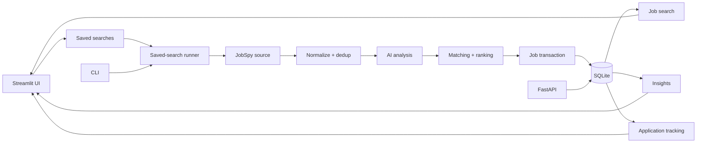

# JobPilot AI

AI-powered job discovery, matching, and application intelligence — a local-first
workspace for collecting, reviewing, and tracking job opportunities.

JobPilot AI is a substantially modified and independently developed project
derived from the open-source [`ai-job-scraper`](https://github.com/BjornMelin/ai-job-scraper)
project by Bjorn Melin, released under the MIT License. See
[`ATTRIBUTION.md`](ATTRIBUTION.md) and [`LICENSE`](LICENSE).

## What it does

JobPilot AI runs a single SQLite-backed pipeline that turns job-board results
into a ranked, trackable application pipeline:

1. **Collect** — saved searches run on demand through a JobSpy discovery source.
2. **Normalize** — raw provider rows are normalized into canonical jobs.
3. **Deduplicate** — fuzzy + fingerprint matching keeps one record per posting.
4. **Analyze** — an LLM (or a deterministic offline fallback) extracts skills,
   salary, and remote fit from each description.
5. **Match** — jobs are scored against your candidate profile with explainable,
   weighted reasons and warnings.
6. **Track** — move jobs through `Inbox`, `Saved`, `Applied`, `Screening`,
   `Interview`, `Offer`, and `Rejected` with stars and private notes.

The Streamlit dashboard has three top-level pages:

- **Jobs** — review jobs, filter by stage/query/company/remote/profile, and run
  the application workflow.
- **Searches** — create repeatable saved searches and run each one on demand.
- **Insights** — workflow counts, listing trends, salary data, and company facets.

There is also a CLI for scripted runs and a FastAPI HTTP API.

## Architecture



Key dependencies: Python 3.12, Streamlit, SQLModel + SQLAlchemy, Alembic,
JobSpy, FastAPI, Typer, and a pluggable AI provider
(`offline` deterministic fallback or any OpenAI-compatible chat endpoint).

See [architecture overview](docs/developers/architecture-overview.md) for
component ownership and transaction rules.

## Quick start

Install [uv](https://docs.astral.sh/uv/), then configure the repository:

```bash
uv sync --locked
cp .env.example .env
```

Apply the schema migrations and (optionally) create starter saved searches:

```bash
uv run --locked alembic upgrade head
uv run --locked jobpilot seed
```

Start the dashboard:

```bash
uv run --locked jobpilot dashboard
```

Open `http://localhost:8501`. Create or review a saved search under
**Searches**, then select **Run now**.

### CLI

```bash
uv run --locked jobpilot scrape          # run all enabled saved searches
uv run --locked jobpilot scrape --search-id 1
uv run --locked jobpilot analyze          # AI-analyze unanalyzed jobs
uv run --locked jobpilot match            # compute matches for the active profile
uv run --locked jobpilot recommend        # top ranked recommendations
uv run --locked jobpilot stats            # aggregated analytics
uv run --locked jobpilot health           # database / provider / budget health
```

### HTTP API

```bash
uv run --locked jobpilot api              # http://127.0.0.1:8000, docs at /docs
```

## Configuration

Settings are read from `.env` (see `.env.example`) or `JOBPILOT_*` environment
variables. The default database URL is `sqlite:///jobpilot.db`.

Key variables:

| Variable | Default | Purpose |
| --- | --- | --- |
| `DB_URL` | `sqlite:///jobpilot.db` | SQLite database location |
| `JOBPILOT_LOG_LEVEL` | `INFO` | Logging level |
| `AI_PROVIDER` | `offline` | `offline` or `openai_compatible` |
| `AI_BASE_URL` | `https://api.openai.com/v1` | Compatible chat endpoint |
| `AI_API_KEY` | unset | **Secret** — never commit or log |
| `AI_MODEL` | `gpt-4o-mini` | Model used by the compatible provider |
| `MATCH_WEIGHTS` | `skill=0.4,…` | Explainable scoring weights (sum to 1.0) |
| `JOBPILOT_CORS_ORIGINS` | `*` | API CORS origins; wildcard rejected in production |
| `JOBPILOT_ENV` | `development` | `production` requires explicit CORS origins |

## Docker

```bash
docker compose up --build
```

The container serves the dashboard on port `8501` as a non-root user and keeps
its SQLite database in a named volume.

## Verify changes

Run the release gates before opening a pull request:

```bash
make format-check check migrate-check test lock-check
```

or directly:

```bash
uv run --locked ruff format --check .
uv run --locked ruff check .
uv run --locked alembic check
uv run --locked pytest -q
uv lock --check
```

## Documentation

- [Get started](docs/user/getting-started.md)
- [Use JobPilot AI](docs/user/user-guide.md)
- [Troubleshoot](docs/user/troubleshooting.md)
- [Understand the architecture](docs/developers/architecture-overview.md)
- [Develop and test](docs/developers/developer-guide.md)
- [API reference](docs/api/api-reference.md)

## Attribution and license

JobPilot AI is derived from [`ai-job-scraper`](https://github.com/BjornMelin/ai-job-scraper)
by Bjorn Melin and is released under the [MIT License](LICENSE). See
[`ATTRIBUTION.md`](ATTRIBUTION.md) for the full provenance and copyright notice.